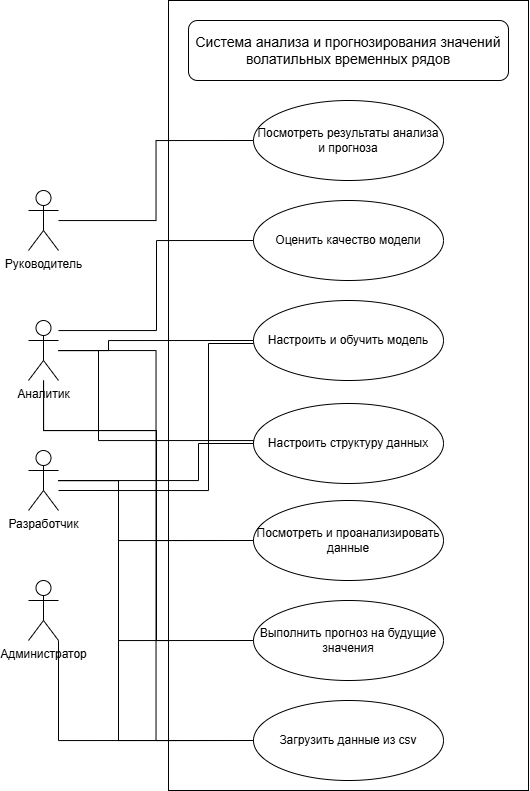

1. Перечень стейкхолдеров

- Аналитик данных, дата-сайнтист.  
  Работает с временными рядами (финансовыми, промышленными, телеметрическими), использует систему для загрузки данных, их анализа, построения графиков и обучения моделей прогнозирования.
- Разработчик.
  Использует систему как инструмент для быстрой проверки гипотез по моделям и признакам, подготовки прототипов решений, а также интеграции результатов в другие системы.
- Руководитель (бизнес-пользователь).  
  Не работает непосредственно с моделями, но потребляет результаты анализа и прогнозов (отчёты, графики), принимает на их основе управленческие решения.
- Администратор системы.  
  Отвечает за развёртывание приложения, настройку окружения, резервное копирование и бесперебойную работу системы.
- Научный руководитель.  
  Использует систему как учебный и демонстрационный инструмент для работы с волатильными временными рядами и моделями прогнозирования.

2. Перечень функциональных требований

- Загрузка данных из файла.  
  Система должна предоставлять возможность загрузки данных временного ряда из файла формата .csv.
- Выбор структуры данных.  
  Система должна позволять пользователю указать столбец даты/времени и столбец целевого показателя (значения временного ряда) из загруженного файла.
- Фильтрация и выбор интервала данных.  
  Система должна предоставлять возможность выбирать для анализа и моделирования как весь набор данных, так и произвольный временной интервал.
- Просмотр и первичный анализ данных.  
  Система должна отображать загруженные данные в табличном виде и предоставлять базовые статистики (минимум, максимум, среднее, стандартное отклонение) и показатели волатильности.
- Визуализация временного ряда.  
  Система должна строить график исходного временного ряда по выбранному столбцу.
- Настройка и обучение модели прогнозирования.  
  Система должна предоставлять возможность выбрать тип модели (например, одна из предложенных моделей), задать ключевые параметры и обучить модель на выбранном подмножестве данных.
- Разделение данных на обучающую и тестовую выборки.  
  Система должна поддерживать разделение данных на обучающую и тестовую части с заданной пользователем пропорцией.
- Построение прогноза.  
  Система должна уметь вычислять прогноз значений временного ряда на заданный пользователем горизонт (количество шагов вперёд) на основе обученной модели.
- Оценка качества модели.  
  Система должна вычислять и отображать метрики качества прогноза (например, MAE, MSE, RMSE) на тестовой выборке.

3. Диаграмма вариантов использования  
   

4. Перечень сделанных предположений

- Пользователь загружает уже предобработанные данные (без пропусков и грубых ошибок формата).
- Временной ряд одномерный (один основной целевой показатель).
- Приложение десктоп и не предусматривает совместной онлайн работы.
- Прогноз выполняется на фиксированный горизонт (например, N шагов вперёд), без онлайн-обновления модели в режиме реального времени.
- Объём данных предполагается таким, что их можно целиком загрузить в память и обработать на одной рабочей станции пользователя.

5. Перечень нефункциональных требований

- Производительность.  
  Система должна загружать и отображать данные объёмом до 1–2 млн строк в разумное время (например, до 30 секунд на типовой машине пользователя).  
  Пересчёт графиков и простых статистик при изменении интервала должен выполняться интерактивно (1–3 секунды).
- Удобство использования (юзабилити).  
  Интерфейс должен быть интуитивно понятным для аналитика без необходимости долгого обучения.  
  Основные операции (загрузка данных, выбор столбцов, построение графика, запуск обучения модели) должны быть доступны с минимальным количеством действий.
- Надёжность и устойчивость к ошибкам.  
  Система должна корректно обрабатывать ошибки формата файла (неправильный CSV, некорректные типы данных) и выдавать пользователю понятные сообщения об ошибках.  
  При сбоях (ошибка модели, обрыв операции) не должен происходить потеря уже загруженных данных.
- Масштабируемость.  
  Архитектура системы должна позволять добавлять новые типы моделей и метрик качества без радикальной переработки основной логики приложения.
- Безопасность данных.  
  Пользовательские данные не должны отправляться на сторонние сервера без явного согласия пользователя.
