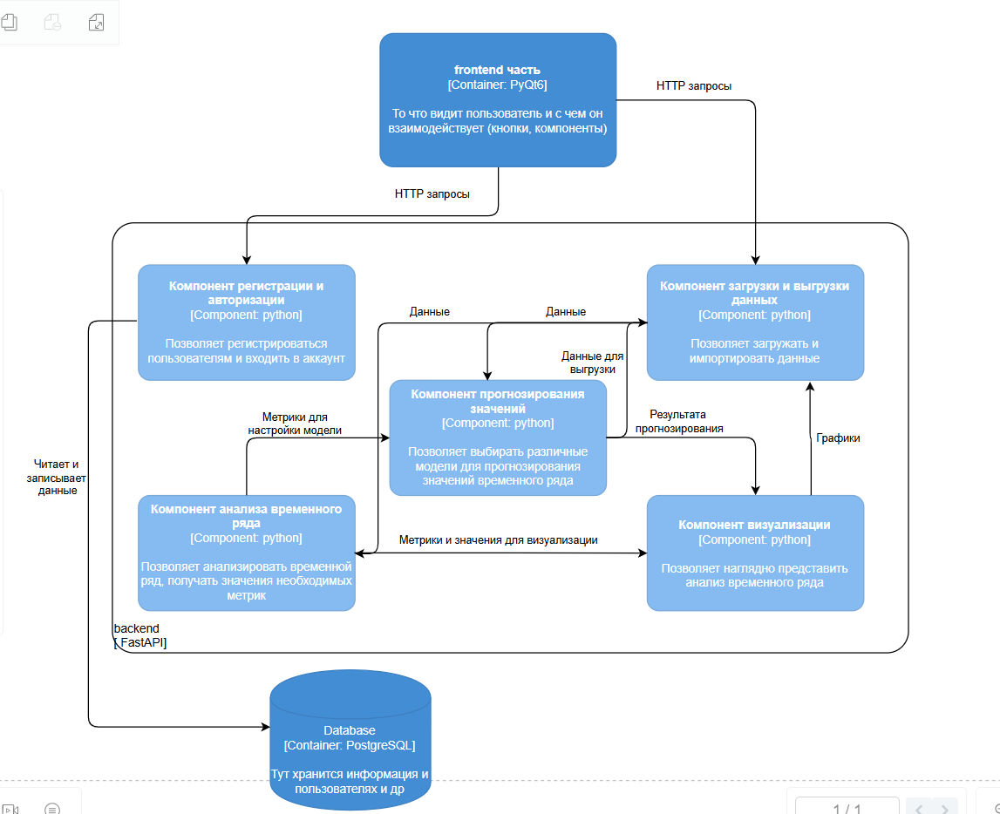
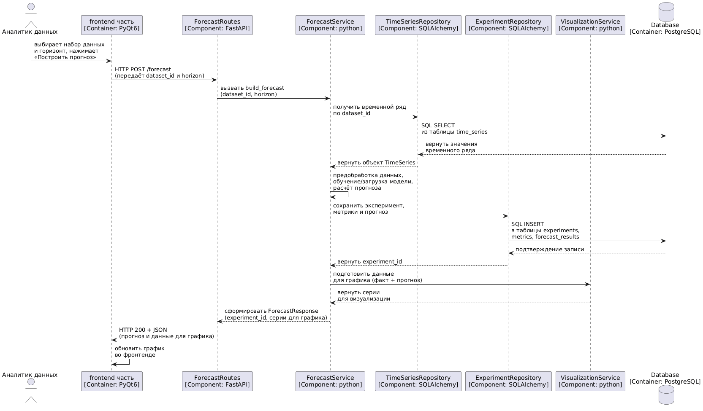
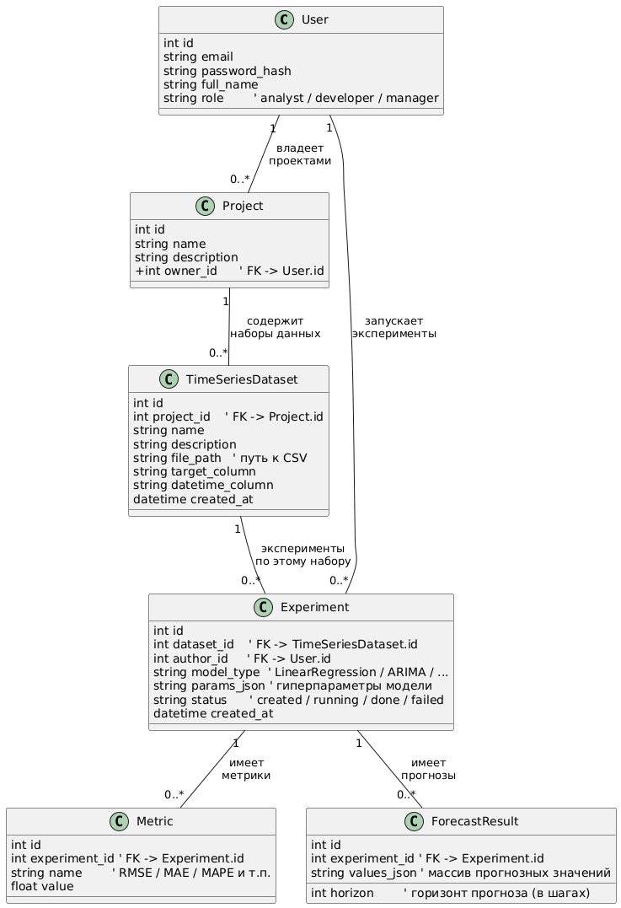

# Лабораторная работа №3
---

## 1) Диаграммы контейнеров и компонентов (C4 model)

### Диаграмма контейнеров


### Диаграмма компонентов



## 2) Диаграмма последовательностей



## 3) Модель БД



---

## 4. Применение основных принципов разработки

### 4.1. KISS (Keep It Simple, Stupid)

**Суть принципа в рамках работы:** каждый модуль выполняет одну простую задачу и не содержит скрытой логики, не относящейся к его ответственности.

**Где применён:**
- forecast_routes.py — HTTP-эндпоинт делает только:
  - валидацию входных данных через DTO,
  - вызов сервиса,
  - преобразование результата в ответ.

**Почему это KISS:**
- Точка входа (API) не знает деталей: где хранится ряд, как устроена модель и как сохраняется эксперимент — поэтому код остаётся простым и стабильным.
- Сервис — один понятный “конвейер” без лишних абстракций и «магии».
- UI остаётся простым: ввод → кнопка → результат/ошибка.

```python
# forecast_routes.py
from fastapi import APIRouter, Depends, HTTPException
from pydantic import BaseModel, Field, PositiveInt

from ..services.forecast_service import ForecastService, ForecastDomainError
from ..services.di import get_forecast_service

router = APIRouter(prefix="/forecast", tags=["forecast"])

class ForecastRequest(BaseModel):
    dataset_id: PositiveInt
    horizon: PositiveInt = Field(..., ge=1, le=10000)

class ForecastResponse(BaseModel):
    experiment_id: int
    metrics: dict[str, float]
    actual: list[float]
    forecast: list[float]

@router.post("", response_model=ForecastResponse)
def build_forecast(
    req: ForecastRequest,
    svc: ForecastService = Depends(get_forecast_service),
) -> ForecastResponse:
    try:
        result = svc.build_forecast(dataset_id=req.dataset_id, horizon=req.horizon)
    except ForecastDomainError as e:
        raise HTTPException(status_code=400, detail=str(e)) from e

    return ForecastResponse(
        experiment_id=result.experiment_id,
        metrics=result.metrics,
        actual=result.actual,
        forecast=result.forecast,
    )
```

### 4.2. YAGNI (You Aren’t Gonna Need It)

**Суть принципа в рамках работы:** не добавлять функциональность «на будущее», пока она не требуется выбранным сценарием лабораторной работы.

**Где применён:**
- forecast_service.py — реализован минимально необходимый pipeline:
  - получение ряда,
  - построение прогноза одной базовой моделью,
  - расчёт 1–2 метрик,
  - сохранение результата эксперимента.

**Что сознательно НЕ реализовано (обоснованный отказ):**
- Очереди задач и фоновые воркеры (Celery/RQ), прогресс-бар по WebSocket.
- Автоподбор гиперпараметров, “модельный зоопарк” и управление версиями моделей.
- Сложные политики прав доступа на уровне отдельных проектов/датасетов, если они не требуются сценарием.
- Расширенная диалоговая логика, автогенерация отчётов “на всё”.

**Почему это YAGNI:** такие функции увеличивают сложность и время реализации, но не дают преимуществ для выполнения ЛР и демонстрации выбранного use case.

```python
# forecast_service.py (фрагмент)
class ForecastService:
    def build_forecast(self, dataset_id: int, horizon: int):
        y = self._ts_repo.get_values_by_dataset_id(dataset_id).values
        model = self._models.create("naive")  # пока одна модель (baseline)
        model.fit(y)
        y_pred = model.predict(horizon)
        metrics = self._metrics.mae(
            y_true=y[-min(horizon, len(y)):],
            y_pred=y_pred[:min(horizon, len(y))]
        )
        exp_id = self._exp_repo.create_result(dataset_id, "naive", horizon, {"mae": metrics}, y_pred)
        return ForecastResultDTO(exp_id, y, y_pred, {"mae": metrics})
```

### 4.3. DRY (Don’t Repeat Yourself)

**Суть принципа в рамках работы:** общая логика сценария не дублируется между слоями и точками входа; алгоритмы вынесены в единые модули.

**Где применён:**
- metrics.py — метрики считаются в одном месте, а не копируются в сервисах.

**Почему это DRY:**
- При добавлении другого эндпоинта (например, preview или debug) можно переиспользовать один и тот же сервис/метрики без копирования.
- Изменение формулы метрики или формата ответа делается в одном месте.

```python
# metrics.py
class MetricsCalculator:
    @staticmethod
    def mae(y_true: list[float], y_pred: list[float]) -> float:
        n = min(len(y_true), len(y_pred))
        if n == 0:
            return 0.0
        return sum(abs(y_true[i] - y_pred[i]) for i in range(n)) / n
```

### 4.4. SOLID

Ниже показано, как принципы SOLID реализуются на уровне классов и взаимодействий.

#### S — Single Responsibility Principle (SRP)

**Где применён:**
- TimeSeriesRepository — только получение ряда.

```python
# time_series_repository.py
from abc import ABC, abstractmethod
from dataclasses import dataclass

@dataclass(frozen=True)
class TimeSeriesRecord:
    dataset_id: int
    values: list[float]

class TimeSeriesRepository(ABC):
    @abstractmethod
    def get_values_by_dataset_id(self, dataset_id: int) -> TimeSeriesRecord:
        ...
```

#### O — Open/Closed Principle (OCP)

**Где применён:**
- Добавление новой модели прогнозирования происходит через новую реализацию интерфейса Forecaster, без изменения ForecastService (он работает с абстракцией).

```python
# model_factory.py
from typing import Protocol

class Forecaster(Protocol):
    def fit(self, y: list[float]) -> None: ...
    def predict(self, horizon: int) -> list[float]: ...

class NaiveForecaster:
    def fit(self, y: list[float]) -> None:
        self._last = y[-1]
    def predict(self, horizon: int) -> list[float]:
        return [self._last] * horizon

class ModelFactory:
    def create(self, model_type: str) -> Forecaster:
        if model_type == "naive":
            return NaiveForecaster()
        raise ValueError("Unknown model_type")
```

#### L — Liskov Substitution Principle (LSP)

**Где применён:**
- ForecastService не зависит от конкретного источника данных.  
  Любая реализация TimeSeriesRepository (SQL/CSV/InMemory) взаимозаменяема при соблюдении контракта.

#### I — Interface Segregation Principle (ISP)

**Где применён:**
- Интерфейсы не «толстые»: репозиторий временных рядов не содержит методов сохранения экспериментов, и наоборот.
- Компоненты зависят только от того, что им реально нужно.

#### D — Dependency Inversion Principle (DIP)

**Где применён:**
- Высокоуровневый модуль ForecastService зависит от абстракций (TimeSeriesRepository, ExperimentRepository, Forecaster), а не от SQLAlchemy/requests.

```python
# di.py
from ..services.forecast_service import ForecastService
from ..services.model_factory import ModelFactory
from ..services.metrics import MetricsCalculator
from ..repositories.time_series_repository_impl import SqlAlchemyTimeSeriesRepository
from ..repositories.experiment_repository_impl import SqlAlchemyExperimentRepository
from ..db.session import get_session

def get_forecast_service() -> ForecastService:
    # инфраструктура собирает зависимости, сервис не знает про SQLAlchemy
    session = next(get_session())
    ts_repo = SqlAlchemyTimeSeriesRepository(session)
    exp_repo = SqlAlchemyExperimentRepository(session)
    return ForecastService(
        ts_repo=ts_repo,
        exp_repo=exp_repo,
        models=ModelFactory(),
        metrics=MetricsCalculator(),
    )
```


## 5) BDUF / SoC / MVP / PoC

### BDUF — Big Design Up Front

**Что это:** сначала подробно всё спроектировать, потом писать код.

**В моём проекте:** *частично применимо.*
- **Да:** полезно заранее сделать “скелет” — C4-диаграммы, основные модули, сущности БД.
- **Нет:** не стоит заранее проектировать все экраны, все модели и метрики до мелочей — в ML-проектах часто многое уточняется по ходу.

**Почему так:** чтобы не переделывать архитектуру, но и не тратить время на лишние детали.

### SoC — Separation of Concerns

**Что это:** разделять систему на части по ответственности, чтобы они меньше мешали друг другу.

**В моём проекте:** *полностью применимо.*
- UI (PyQt) — только интерфейс.
- API (FastAPI) — только принимает запросы/отдаёт ответы.
- Сервисы — бизнес-логика (прогноз, анализ).
- Репозитории — работа с БД/файлами.
- ML-модуль — модели/метрики.

**Почему так:** если поменять БД или модель, UI и API почти не придётся трогать.

### MVP — Minimum Viable Product

**Что это:** сначала сделать минимальную рабочую версию, потом улучшать.

**В моём проекте:** *полностью применимо.*

**Мой MVP:**
- загрузить ряд (CSV)
- построить прогноз (1 модель)
- посчитать 1–2 метрики
- сохранить эксперимент и результат

**Почему так:** быстрее получить рабочий результат и закрыть требования лабораторной, а потом расширять.

### PoC — Proof of Concept

**Что это:** быстрый прототип “проверить, что идея вообще работает”.

**В моём проекте:** *частично применимо.*
- PoC полезен для ML: быстро проверить, что модель реально строит прогноз на моих данных.
- Но PoC не должен быть финальной версией, потому что в лабораторной нужен “нормальный” код и архитектура.

**Почему так:** PoC снижает риск, что мы строим систему, а алгоритм потом окажется бесполезным.

