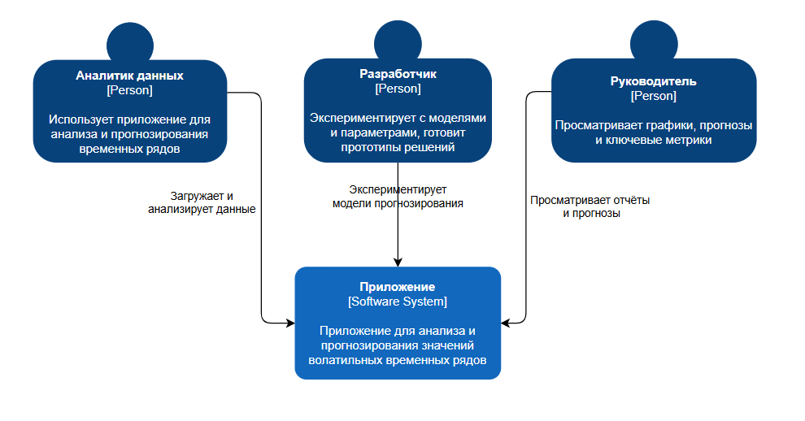
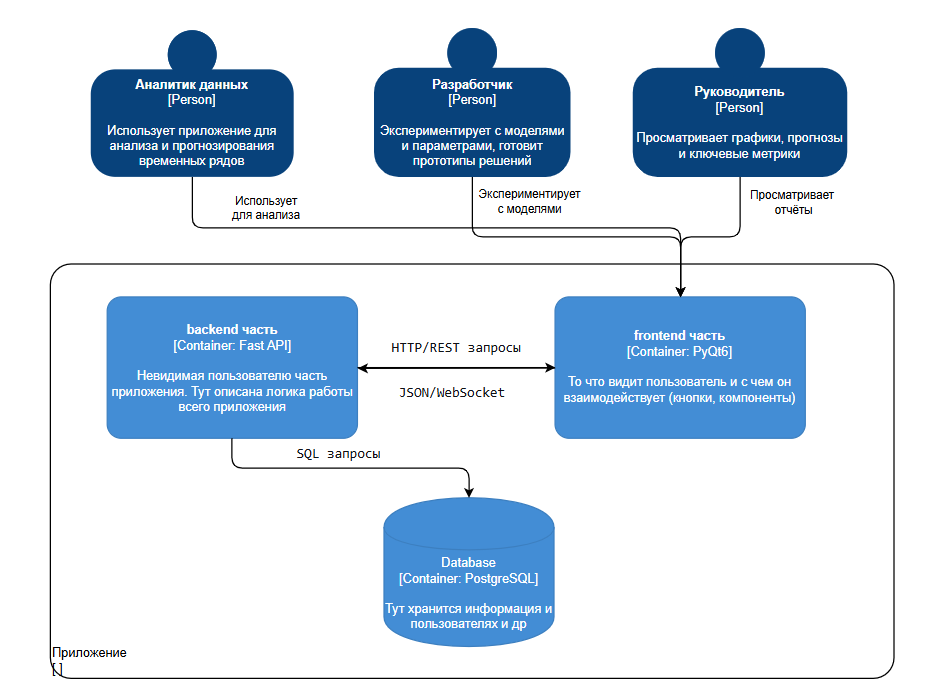

# Лабораторная работа №2  
**Тема:** Использование нотации C4 model для проектирования архитектуры программной системы  

---

## 1. Диаграмма системного контекста

На диаграмме показано, кто и как взаимодействует с системой на самом верхнем уровне абстракции:

- **Аналитик данных** — загружает и анализирует данные временных рядов, использует приложение для расчёта метрик и построения прогнозов.  
- **Разработчик** — экспериментирует с моделями и параметрами, настраивает алгоритмы прогнозирования и проверяет гипотезы.  
- **Руководитель** — просматривает графики, прогнозы и ключевые метрики, подготовленные аналитиком и разработчиком.

Все три типа пользователей работают через **единое приложение** (software system), которое предоставляет интерфейсы для загрузки данных, анализа и получения прогнозов.

---

## 2. Диаграмма контейнеров

Эта диаграмма показывает, из каких крупных частей состоит приложение и как они взаимодействуют:

- **frontend часть**  
  То, что видит пользователь: окна, формы, кнопки и графики. Через frontend пользователи отправляют запросы на анализ, обучение моделей и построение прогнозов.

- **backend часть**  
  Невидимая пользователю часть. Здесь реализована вся бизнес-логика:
  - обработка HTTP/REST и JSON/WebSocket-запросов от frontend’а;
  - вызовы функций анализа и прогнозирования;
  - работа с базой данных.

- **Database**  
  Хранилище данных, где сохраняется информация о пользователях, проектах, наборах данных, результатах анализа и метриках моделей. Backend обращается к БД через SQL-запросы.

Пользователи взаимодействуют только с **frontend-контейнером**, который по HTTP/REST/JSON/WebSocket общается с **backend-контейнером**, а тот, в свою очередь, читает и записывает данные в **PostgreSQL**.

---

## 3. Диаграмма компонентов

На диаграмме компонентов показана детализация контейнеров, в первую очередь backend-части:

- **frontend часть**  
  Отправляет HTTP-запросы в backend: регистрация/логин, загрузка данных, запуск анализа, построение прогнозов и запрос графиков.

- **Компонент регистрации и авторизации**  
  Обрабатывает регистрацию новых пользователей и вход в систему. Работает с базой данных, где хранится информация о пользователях.

- **Компонент анализа временного ряда**  
  Выполняет расчёт базовых статистик и метрик волатильности по выбранному временному ряду. Использует данные из БД и передаёт рассчитанные метрики дальше.

- **Компонент прогнозирования значений**  
  На основе выбранной модели и подготовленных данных строит прогноз значений временного ряда. Получает метрики и данные от компонента анализа, возвращает результаты для визуализации и выгрузки.

- **Компонент загрузки и выгрузки данных**  
  Отвечает за импорт временных рядов (CSV и др.) и экспорт результатов анализа и прогнозов. Передаёт загруженные данные в анализ и прогноз, а результаты — во внешние файлы.

- **Компонент визуализации**  
  Формирует графики и наглядные представления анализа и прогнозов, которые затем отображаются во frontend-части.

- **Database**  
  Используется всеми backend-компонентами для чтения и записи данных (пользователи, наборы данных, результаты анализа, метрики моделей).

Таким образом, frontend отправляет запросы в backend, backend-компоненты координируют анализ, прогнозирование и работу с БД, а результаты в виде графиков и отчётов возвращаются в интерфейс пользователя.

