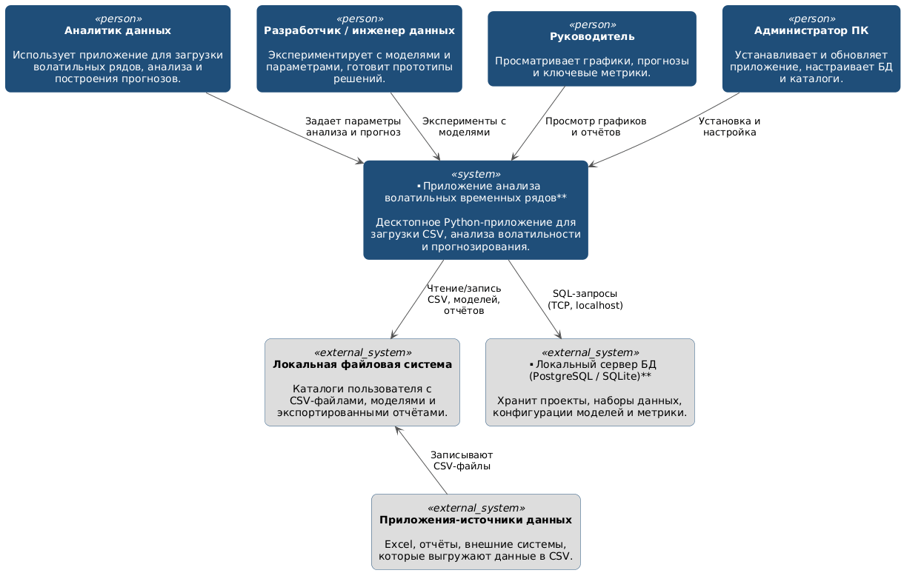
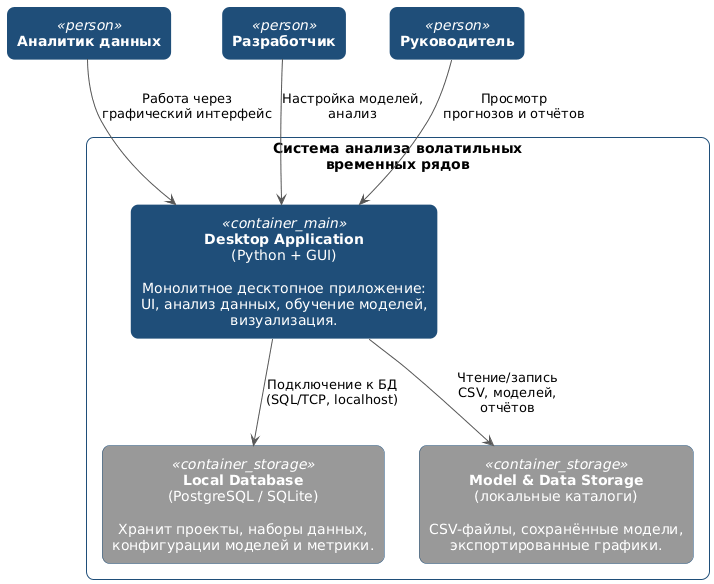
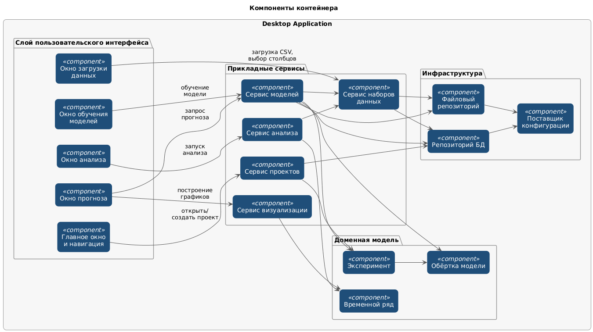
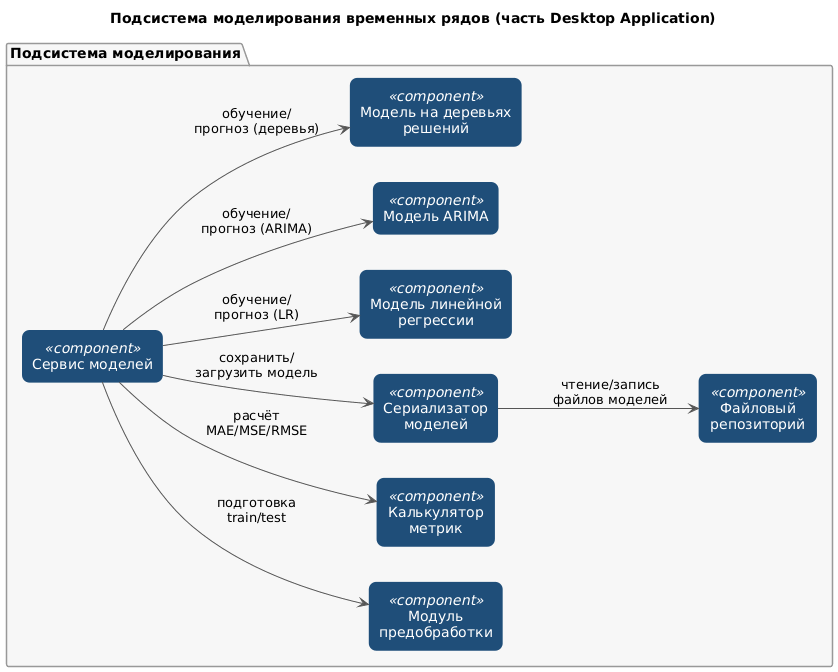

# Лабораторная работа 2  

## Тема: Использование нотации C4 model для проектирования архитектуры программной системы

Вариант системы: **десктопное Python-приложение для анализа и прогнозирования значений волатильных временных рядов**.

Цель работы: получить опыт использования графической нотации для фиксации архитектурных решений на уровнях контекста, контейнеров и компонентов.

---

## 1. Диаграмма системного контекста

Диаграмма системного контекста показывает, как система анализа волатильных временных рядов встроена в окружение пользователей и какие внешние системы с ней взаимодействуют. На этом уровне рассматриваются только границы системы и её связи с актороми, без детализации внутренней структуры.

### 1.1. Основные элементы

1. **Пользователи системы**

   - **Аналитик данных**  
     Загружает временные ряды из файлов, проводит анализ волатильности, подбирает и обучает модели, оценивает качество прогнозов.

   - **Разработчик / инженер данных**  
     Использует приложение для быстрого прототипирования моделей, проверки гипотез и подготовки экспериментальных отчётов.

   - **Руководитель**  
     Открывает готовые проекты, просматривает графики, прогнозы и ключевые метрики для поддержки управленческих решений.

   - **Администратор ПК**  
     Устанавливает и обновляет приложение, настраивает локальный сервер базы данных, следит за правами доступа к каталогам и ресурсами рабочей станции.

2. **Система в фокусе**

   - **Приложение анализа волатильных временных рядов**  
     Локальное десктопное Python-приложение, которое позволяет загружать временные ряды из CSV, выполнять исследовательский анализ, рассчитывать показатели волатильности, обучать модели прогнозирования и визуализировать результаты.

3. **Внешние системы**

   - **Локальная файловая система**  
     Каталоги пользователя, в которых хранятся исходные CSV-файлы, сохранённые модели, экспортированные графики и отчёты.

   - **Локальный сервер БД (PostgreSQL / SQLite)**  
     Отдельный процесс/служба, с которой приложение взаимодействует по TCP (`localhost`). Хранит проекты, наборы данных, конфигурации моделей и метрики.

   - **Приложения-источники данных (Excel и др.)**  
     Инструменты, из которых пользователь выгружает данные в CSV для последующей загрузки в приложение.

### 1.2. Иллюстрация

---

## 2. Диаграмма контейнеров

Диаграмма контейнеров показывает, из каких исполняемых приложений и хранилищ данных состоит система, и как эти контейнеры взаимодействуют между собой и с пользователями. В терминах C4 контейнер — это развёртываемое приложение или база данных, а не обязательно Docker-контейнер.

### 2.1. Основные контейнеры системы

1. **Desktop Application (Python + GUI)**  
   - Тип: монолитное десктопное приложение.  
   - Назначение:  
     - формы загрузки CSV и настройки структуры данных (столбец даты/времени, целевой показатель, дополнительные признаки);  
     - запуск анализа и расчёта показателей волатильности;  
     - обучение моделей прогнозирования и построение прогнозов;  
     - визуализация исходных и прогнозных временных рядов;  
     - работа с локальной БД и файловой системой.  
   - Пользователи: аналитики, разработчики, руководители.

2. **Local Database (PostgreSQL / SQLite)**  
   - Тип: реляционная СУБД, запущенная на рабочей станции пользователя.  
   - Назначение:  
     - хранение сущностей «проект», «набор данных», «эксперимент», «модель»;  
     - хранение конфигураций моделей и параметров обучения;  
     - хранение рассчитанных метрик и служебной информации.

3. **Model & Data Storage (локальные каталоги)**  
   - Тип: файловое хранилище на локальном диске.  
   - Назначение:  
     - хранение исходных CSV-файлов временных рядов;  
     - хранение сериализованных моделей (weights/checkpoints);  
     - хранение экспортированных графиков и отчётов в файловом виде.

### 2.2. Причины выбора архитектурного стиля

В качестве базового архитектурного стиля выбрана **монолитная настольная архитектура с вынесенным сервером БД**:

1. **Простота развёртывания и эксплуатации**  
   Пользователь устанавливает одно десктопное приложение и локальный сервер БД. Вся бизнес-логика сосредоточена внутри одного процесса, отсутствуют микросервисы и сложная сеть взаимодействий.

2. **Разделение ответственности по контейнерам**  
   - логика работы с данными, моделями и UI находится в монолите Desktop Application;  
   - долговременное структурированное хранение вынесено в отдельный контейнер Local Database;  
   - крупные файлы данных и моделей хранятся в файловой системе.

3. **Наличие сетевого взаимодействия**  
   Desktop Application подключается к серверу БД по сетевому протоколу (TCP, `localhost:порт`), что соответствует требованию топологии с несколькими модулями развертывания и сетевой связью между ними.

4. **Возможность эволюции**  
   При необходимости сервер БД можно вынести на отдельную машину или заменить тип СУБД без переписывания основной логики приложения.

### 2.3. Диаграмма

---

## 3. Диаграмма компонентов контейнера Desktop Application

Диаграмма компонентов детализирует внутреннюю структуру монолитного десктопного приложения. На этом уровне показываются основные подсистемы, их ответственность и связи.

### 3.1. Основные компоненты Desktop Application

1. **Слой пользовательского интерфейса**

   - **Главное окно и навигация**  
     Управляет открытием проектов, переключением между разделами («Данные», «Анализ», «Модели», «Прогноз»).

   - **Окно загрузки данных**  
     Позволяет выбрать CSV-файл, предварительно просмотреть структуру, указать столбец даты/времени и целевой показатель.

   - **Окно анализа**  
     Позволяет выбрать интервал данных, запускать расчёт статистик и показателей волатильности, просматривать табличные результаты.

   - **Окно обучения моделей**  
     Позволяет выбрать набор данных, тип модели, параметры обучения, запускать обучение и просматривать метрики качества.

   - **Окно прогноза**  
     Показывает графики фактических и прогнозных значений, ошибки прогноза, позволяет сравнивать разные эксперименты.

2. **Прикладные сервисы**

   - **Сервис проектов**  
     Управляет жизненным циклом проекта: создание, открытие, сохранение, список последних проектов.

   - **Сервис наборов данных**  
     Регистрирует наборы данных, хранит информацию о структуре (столбцы, типы), связке с файлами на диске.

   - **Сервис анализа**  
     Реализует расчёт базовых статистик и метрик волатильности (среднее, стандартное отклонение, изменение за период, скользящие показатели и др.).

   - **Сервис моделей**  
     Управляет обучением и использованием моделей: создаёт конфигурации экспериментов, запускает обучение, сохраняет и загружает модели, инициирует прогноз.

   - **Сервис визуализации**  
     Готовит данные для построения графиков: объединяет фактические и прогнозные значения, рассчитывает линии ошибок и т.п.

3. **Инфраструктура**

   - **Репозиторий БД**  
     Инкапсулирует доступ к локальной базе данных: CRUD-операции над проектами, наборами данных, экспериментами и метриками.

   - **Файловый репозиторий**  
     Отвечает за чтение CSV, сохранение моделей и экспорт графиков/отчётов в файловую систему.

   - **Поставщик конфигурации**  
     Загружает настройки приложения (пути к каталогам, строку подключения к БД, параметры по умолчанию).

4. **Доменная модель**

   - **Временной ряд**  
     Представляет последовательность наблюдений с временными метками; содержит операции выборки по интервалам и агрегации.

   - **Эксперимент**  
     Описывает конкретный запуск обучения/прогноза: тип модели, параметры, использованный набор данных, полученные метрики.

   - **Обёртка модели**  
     Унифицирует интерфейс работы с разными типами моделей (линейная регрессия, ARIMA, модели на деревьях и т.п.) через методы `fit`/`predict`.

### 3.2. Взаимодействие компонентов

- Компоненты UI вызывают соответствующие прикладные сервисы (загрузка данных, анализ, обучение, прогноз).  
- Прикладные сервисы обращаются к доменной модели (объекты «Временной ряд», «Эксперимент») и к инфраструктуре (репозитории БД и файлов).  
- Репозитории инкапсулируют низкоуровневую работу с СУБД и файловой системой, оставляя остальной части приложения чистую доменную логику.

### 3.3. Иллюстрация

---

## 4. Дополнительная диаграмма компонентов (подсистема моделирования)

Для повышенной сложности дополнительно детализируется подсистема моделирования временных рядов внутри Desktop Application.

### 4.1. Основные компоненты подсистемы моделирования

1. **Сервис моделей**  
   Внешний фасад подсистемы для остальной части приложения. Принимает запросы на обучение и прогноз, выбирает тип модели, управляет жизненным циклом эксперимента.

2. **Модуль предобработки**  
   Готовит данные для обучения и прогноза:  
   - формирует обучающую и тестовую выборки;  
   - создаёт лаги и скользящие окна;  
   - при необходимости нормализует признаки.

3. **Модель линейной регрессии**  
   Реализация простого линейного подхода к прогнозированию на основе сгенерированных признаков.

4. **Модель ARIMA**  
   Реализация классической модели временных рядов ARIMA/ SARIMA (на базе библиотеки statsmodels).

5. **Модель на деревьях решений**  
   Пример нелинейной модели (RandomForest/GradientBoosting), способной улавливать сложные зависимости в признаках.

6. **Калькулятор метрик**  
   Рассчитывает показатели качества модели: MAE, MSE, RMSE, MAPE и др.

7. **Сериализатор моделей**  
   Сохраняет обученные модели в файлы и загружает их при повторном открытии проекта или запуске прогноза.

8. **Файловый репозиторий**  
   Предоставляет операции чтения/записи файлов моделей на диск.

### 4.2. Взаимодействие компонентов

1. Сервис моделей получает от прикладного уровня запрос на обучение модели с указанием набора данных и параметров.  
2. Модуль предобработки формирует обучающие и тестовые выборки и передаёт их выбранной модели (линейная регрессия, ARIMA или дерево).  
3. После обучения модель передаёт результаты в калькулятор метрик, который рассчитывает показатели качества.  
4. Сериализатор моделей с помощью файлового репозитория сохраняет обученную модель на диск и при необходимости загружает её для последующих прогнозов.  
5. При запросе прогноза сервис моделей использует сериализованную модель, снова вызывает модуль предобработки для подготовки входных данных и возвращает прогноз в верхний уровень приложения.

### 4.3. Иллюстрация

